# Hi there 👋
My name is Rich. I'm an AI Engineer AI Justice Unit ⚖️.

- 🔭 I’m interested in transport modelling and policy priority inference.
- 🌱 I’m learning GenAI with everybody else. 
- 📫 How to reach me:  
    - <a href="https://x.com/Rich_L1984">Find me on X.</a> I mostly reshare interesting posts from the open-source development community. 
    - <a href="https://www.linkedin.com/in/richard-leyshon-316121163/">Profile on LinkedIn.</a> I use this channel to keep up with colleagues' career development.
- ⚡ Fun fact: I enjoy blogging on content related to programming. Please check out [The Data Savvy Corner](https://thedatasavvycorner.com/).

To see more information about my experience, please [click to view my resume](https://r-leyshon.github.io/resume/).
